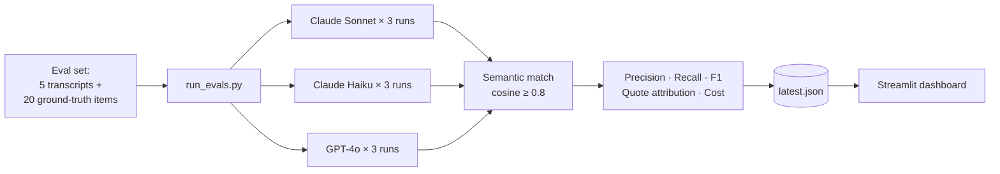

# 📊 Audit — LLM Eval Pipeline

> **Compares GPT-4o, Claude Sonnet 4.6, and Claude Haiku 4.5 on Project 2's extraction task. Replaces vibes with numbers.**

---

## Demo

[**▶ Watch the 2-minute demo on Loom**](https://www.loom.com/share/PASTE_LOOM_URL_HERE)

<!-- Optional screenshot: ./assets/dashboard.png -->

---

## The problem

Most teams shipping LLM features make model and prompt decisions on vibes. *"Claude feels better." "We tried it on a few examples and it seemed fine."* Without an eval set, every model swap, prompt tweak, or vendor change is a coin flip on whether the product just got worse.

---

## The solution

A small, opinionated eval harness. Hand-labeled ground truth on Project 2's user-interview extraction task — 5 transcripts, ~20 ground-truth pain points. Runs each of three models 3× per case, reports precision, recall, F1, quote attribution accuracy, and cost per transcript. Outputs a JSON results file and a Streamlit dashboard.

This isn't a benchmark suite. It's the smallest possible eval that produces *defensible answers* about which model to ship.

---

## Architecture



---

## Stack

- **Models compared:** Claude Sonnet 4.6, Claude Haiku 4.5, GPT-4o
- **Matching:** OpenAI embeddings + greedy 1:1 cosine alignment (threshold 0.8)
- **Variance:** 3 runs per cell, mean ± stddev reported (single runs lie about non-determinism)
- **Quote attribution:** Substring check on every extracted quote — catches hallucinated quotes that pass the semantic match
- **Dashboard:** Streamlit + pandas

---

## Read the PM work

- 📋 [**PRD**](./PRD.md) — what this measures and what it doesn't, success metrics, roadmap
- 📝 [**Case study**](./case-study.md) — why I built ground truth by hand, why threshold matters, what I'd ship next

---

## Run it

```bash
cd 03-llm-eval-pipeline
python3 -m venv .venv && source .venv/bin/activate
pip install -r requirements.txt
python run_evals.py        # ~3-5 min, ~$0.50-$1 in API calls
streamlit run dashboard.py
```

The eval set is `src/data/interview_eval_set.json` — points at Project 2's sample transcripts.

---

## What's deliberately limited (v0.1)

- 5-transcript eval set is statistically thin (v0.2 expands to 30+, with second annotator + Cohen's kappa)
- Semantic match threshold (0.8) is empirical — no sensitivity sweep yet
- No latency dashboard (cost is reported; latency is not first-class)
- Single task — multi-task support in v1.0

The PRD owns these honestly.

---

*Built by [Aafreen Fathima](https://github.com/aafreen-fathima) · May 2026. Companion projects: [Paperback](https://github.com/aafreen-fathima/paperback) (RAG research assistant) and [Signal](https://github.com/aafreen-fathima/signal) (the agent this pipeline evaluates).*
